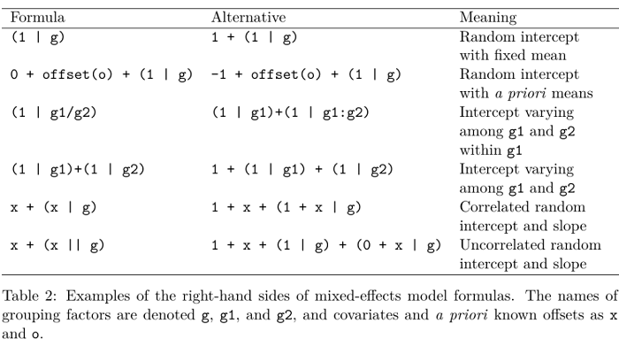
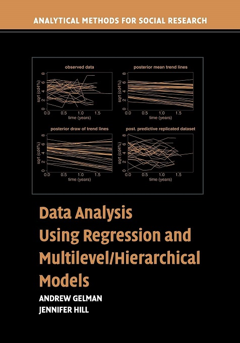

```{r setup, include=FALSE}
knitr::opts_chunk$set(echo = TRUE, warning = FALSE, message = FALSE, eval = FALSE)

library(plyr)
library(brms)
library(ggplot2)
library(MRColour)
library(cowplot)
theme_set(theme_grey())

options(scipen = 10)

load("U:/Projects/bayesianMLM/IIG_talk/logRT_model.RData")

n         <- length(unique(stroopData$subNum))
trialNum  <- ddply(stroopData, c('subNum'), summarise, trialsNum = length(RT))
```

# Aim of talk
* Showing how easy it is to implement prober Bayesian mutlilevel models,
* but making you vary of some of the dangers. 
* Analysising RT data with [`BRMS`](https://cran.r-project.org/web/packages/brms/index.html) package. 

# Example data
* Stroop task:
    + `r n` participants,
    + On average `r round(mean(trialNum$trialsNum))` trials per participant,
    + Congruency: 4 incongruent vs 4 neutral words.
    + DV: Reaction time.
* We want to accurately account for participant and stimulus variation. 
    + Therefore we use mutlilevel approach that includes stimulus and participants as crossed random effects (Judd et al., 2012).

$$log(RT) \sim congruency + (congruency | subNum) + (1 | stimulus)$$

Our hypotheses are:

$$H_0: \beta_{congruency} = 0 \lor H_1:$$

# Data preparation
```{r}
load("exampleData/stroopData.RData")
```

After loading, we transform from raw RT data to log(RT),
```{r}
stroopData$logRT <- log(stroopData$RT)
```

and then we scale the data to have a mean of 0 and a SD of 1. 

```{r}
stroopData$s_logRT <- scale(stroopData$logRT)
```

This important because parameters (e.g. $\beta$-values) and hence priors depend on the scale of the data. 

# BRMS vs. lme4


- BRMS use the same syntax as `lme4`.
- Also, most functions we know from `lme4` still work, e.g. `ranef()`, `fixef()` and `coef()`.
- When you get it to work, it's very flexible. 


# lmer results
```{r, eval = TRUE}
library(lme4)
logRT_lme4_m1 <- lmer(s_logRT ~ congruency + (congruency | subNum) + (1 | stimulus),data = stroopData)
summary(logRT_lme4_m1)
```

# Our BRMS model
To run our model we first set priors for our population-level effects:
```{r}
priors <- c(prior(normal(0, 1), class = "Intercept"), 
            prior(normal(0, 1), class = "b"))
```

Since the DV has mean of 0 and SD = 1, $\beta$-values > 1 are very unlikely. 

```{r,  eval = FALSE, echo= TRUE}
logRT_bayes_m1 <- brm(s_logRT ~ congruency + (congruency | subNum) + (1 | stimulus),
                      save_all_pars = TRUE,
                      sample_prior = TRUE,
                      data = stroopData,
                      cores = 8,
                      chains = 8,
                      iter = 3000,
                      prior = priors)
```

To fit our model, we use the same syntax that we would used in `lme4`. To get stable estimates, we set a relatively high number of `iter` per Markov-chain. 

# Our BRMS model
```{r eval = TRUE}
summary(logRT_model)
```

# Fixed effects
To extract our population-level effects we can just use:
```{r eval = TRUE}
fixef(logRT_model)
```

# Extracting random effects
```{r}
ranef_logRT_model <- coef(logRT_model)
```

or for the specific coefficents:

```{r eval = TRUE}
coef_logRT_model <- coef(logRT_model)
head(coef_logRT_model$subNum[,,'congruencyneutral'])
```

Above you see the estimated slope for the first 6 participants. 

# Visualisation of results
```{r eval = TRUE, echo = FALSE, fig.align="center"}
# Extract coefficients
coef_logRT_model <- coef(logRT_model)

df <- data.frame(Congruency = c(rep('Incongruent', n), 
                                rep('Neutral', n)),
                 RT = c(coef_logRT_model$subNum[,1,1], 
                        coef_logRT_model$subNum[,1,1] + coef_logRT_model$subNum[,1,2]),
                 lower = c(coef_logRT_model$subNum[,3,1],
                           coef_logRT_model$subNum[,1,1] + coef_logRT_model$subNum[,3,2]),
                 upper = c(coef_logRT_model$subNum[,4,1],
                           coef_logRT_model$subNum[,1,1] + coef_logRT_model$subNum[,4,2]),
                 Subject = factor(c(1:n, 1:n)))

ggplot(df, aes(x = Congruency, y = RT, colour = Subject, group = Subject)) + 
  geom_point() + 
  geom_line() +
  geom_errorbar(aes(ymin=lower, ymax=upper), width=.1) +
  scale_color_mrc(palette = "secondary") +
  labs(y = 'scaled log(RT)', title = 'Estimated effect per participant')
```

# Visualisation of results
```{r eval = TRUE, echo = FALSE, fig.align="center"}
# Extract coefficients
postSamples <- posterior_samples(logRT_model)


nSamples <- 1000
df <- data.frame(Congruency = c(rep('Incongruent', nSamples), 
                                rep('Neutral', nSamples)),
                 RT = c(postSamples$b_Intercept[1:nSamples], 
                        postSamples$b_Intercept[1:nSamples] + postSamples$b_congruencyneutral[1:nSamples]),
                 ID = c(1:nSamples, 1:nSamples))

ggplot(df, aes(x = Congruency, y = RT, group = ID)) + 
  geom_point(alpha = 0.1) + 
  geom_line(alpha = 0.1) + 
  labs(y = 'scaled log(RT)', title = 'Draws of population-level effect')
```

# What so special about Bayesian linear models
Instead of point estimates for $\beta_{0ij}$ and $\beta_{1ij}$, we get *posterior* distributions (`iter/2` x `chains` = `r 8*1500` samples):

```{r eval = TRUE, echo = FALSE, fig.align="center"}
postSamples <- posterior_samples(logRT_model)

Parameter <- c(rep('Intercept', length(postSamples$b_Intercept)),
               rep('Congruency',length(postSamples$b_congruencyneutral)))

Values    <- c(postSamples$b_Intercept,
               postSamples$b_congruencyneutral)

postSamples_df <- data.frame(Parameter = Parameter,
                             Values = Values)

dummy1 <- data.frame(Parameter = 'Intercept', x = c(fixef(logRT_model)[1, 3], 
                                                    fixef(logRT_model)[1, 4]))

dummy2 <- data.frame(Parameter = 'Congruency', x = c(fixef(logRT_model)[2, 3], 
                                                     fixef(logRT_model)[2, 4]))

# Plot
ggplot(postSamples_df, aes(x = Values, fill = Parameter)) + 
  facet_grid(. ~ Parameter) +
  geom_vline(xintercept = c(0), linetype ="dotted", size = 1) +
  geom_vline(data = dummy1, aes(xintercept = x)) +
  geom_vline(data = dummy2, aes(xintercept = x)) +
  geom_density(alpha = 0.5) + 
  labs(y = 'Density',
       x = 'Estimate',
       title = 'Posterior distributions with 95% CI') +
  scale_fill_mrc()  +
  theme(legend.position = 'none')
```

"In Bayesian statistics, a **credible interval** is an interval within which an unobserved parameter value falls with a particular probability" (source: [wiki](https://en.wikipedia.org/wiki/Credible_interval)). 

\> Evidence in favour of effect if no overlap with zero.

# Bayesian multilevel models
For instance,
let $\alpha$ be the common intercept and $\boldsymbol{\beta}$ be the common coefficients while $a_j$ is the deviation from the common intercept in the $j$-th group and $\mathbf{b}_j$ is the deviation from the common coefficients. 
Write the model as:
$$y_{ij} = \alpha + \sum_{k = 1}^K \beta_k x_{ik}+\underbrace{a_j + \sum_{k = 1}^K b_{jk} x_{ik} +\overbrace{\boldsymbol{\epsilon}}^{\mbox{Bayesian error}}}_{\mbox{Frequentist error}}$$

- Frequentists assume that $a_j$ and $b_j$ deviate from the common parameters according
  to a (multivariate) normal distribution, whose (co)variances are common parameters
  to be estimated.
- To Frequentists, $a_j$ and $b_j$ are not parameters because parameters must remained
  fixed in repeated sampling of observations from some population.
- Since $a_j$ and $b_j$ are not parameters, they can't be "estimated" only "predicted".
- Since $a_j$ and $b_j$ aren't estimated, they must be integrated out of
  the likelihood function, leaving an integrated likelihood function of the common
  parameters.
  
Ben Goodrich, [Cambridge 2019](https://mc-stan.org/workshops/stancon2019_hierarchical/) 

# Bayesian multilevel models
- Provide standard error and CI for parameters:
    + Random effects,
    + Family parameters.
    + If you still wand standard error from `lme` use `arm` package (e.g. `se.ranef`). 
- Allow use of prior information. 
- According to [Andrew Gelman](https://statmodeling.stat.columbia.edu/2007/09/06/classical_or_ba/):
    + Bayesian model work best if group-level variance is hard to estimate
    + And number of groups in small. 

# Bayesian inference
- We can make inference about effects with
    + Examing credible intervals and
    + Quantify evidence by using Bayes factors.

# Bayes factors
Bayes factors are calculated from from Marginal Likelihoods:
$$ BF_{10} =\frac{likelihood\ of\ data\ given\ H_1}{likelihood\ of\ data\ given\ H_o} = \frac{P(D|H_1)}{P(D|H_0)}$$
In our example we get get $BF_{10}$ by fitting a **null model** that doesn't include our effect of interest: 

```{r}
logRT_bayes_m0 <- brm(s_logRT ~ 1 + (congruency | subNum) + (1 | stimulus),
                   save_all_pars = TRUE,
                   sample_prior = TRUE,
                   data = stroopData,
                   cores = 8,
                   chains = 8, 
                   iter = 3000,
                   prior = priors)
```

for our null model we only need a prior for the Intercept.

```{r}
priors <- c(prior(normal(0, 1), class = "Intercept"))
```

# Bayes factors
We then use
```{r}
bf <- bayes_factor(logRT_bayes_m1, logRT_bayes_m0)
```

and get $BF_{10}$ = `r round(as.numeric(bf)[1], 2)`, which is moderate evidence for $H_1$. We get similar results with `lme4`:

```{r, eval = TRUE}
logRT_lme4_m0 <- lmer(s_logRT ~ 1 + (congruency | subNum) + (1 | stimulus),data = stroopData)
anova(logRT_lme4_m0, logRT_lme4_m1)
```


# Bayes factors
Another way calcualte the BF is the Savage-Dickey ratio that is 
$$ BF_{10} = \frac{p(D|H_{1})}{p(D|H_{0})} = \frac{p(\theta = 0|H_{1})}{p(\theta = 0|D,H_{0})}$$

```{r echo = FALSE, eval = TRUE,fig.align="center"}
library(polspline)
postSamples   <- posterior_samples(logRT_model)
fit.posterior <- logspline(postSamples$b_congruencyneutral)
posterior     <- dlogspline(0, fit.posterior) 
prior         <- dnorm(0, 0, 1)
BF10          <- round(prior/posterior, 2)


exampleDenPoints <- data.frame(Distribution = c('Prior', 'Posterior'),
                               x = c(0, 0),
                               Density = c(prior,
                                           posterior))

xValues <- seq(-3, 3, by = .01)
exampleDensityCurves <- data.frame(Distribution = c(rep('Prior', length(xValues)), 
                                                    rep('Posterior', length(xValues))),
                                   Parameter = xValues,
                                   Density =c(dnorm(xValues, 0, 1),
                                              dlogspline(xValues, fit.posterior) ))

examplePlot <- ggplot(exampleDensityCurves, aes(x = Parameter, y = Density, colour = Distribution)) +
  geom_line() +
  scale_color_mrc() +
  theme(legend.position = c(1, 1),
        legend.justification = c(1, 1),
        plot.margin = unit(c(1,1,1,1), "lines")) +
  coord_cartesian(ylim = c(0,
                           max(exampleDensityCurves$Density)*1.1),
                  xlim = c(-3, 3),
                  expand = FALSE)

exampleZoomPlot <- ggplot(exampleDensityCurves, aes(x = Parameter, 
                                                    y = Density, 
                                                    colour = Distribution)) +
  geom_line() +
  scale_color_mrc() +
  geom_point(data = exampleDenPoints, aes(x = x, y = Density)) +
  annotate('text', x = 0, y = posterior-0.01, label = as.character(round(posterior, 6))) +
  annotate('text', x = 0, y = prior-0.01, label = as.character(round(prior, 6))) +
  coord_cartesian(ylim = c(0,
                           max(exampleDenPoints$Density)*1.1),
                  xlim = c(-0.1,
                           0.1),
                  expand = FALSE) +
  theme(legend.position = "none",
        plot.margin = unit(c(1,1,1,1), "lines"))

plot_grid(examplePlot, exampleZoomPlot)
```


# Bayes factors
We calculate the Savage-Dickey ratio following Wagenmakers et al. (2010)
```{r, eval = TRUE}
library(polspline)

postSamples   <- posterior_samples(logRT_model)
fit.posterior <- logspline(postSamples$b_congruencyneutral)
posterior     <- dlogspline(0, fit.posterior) 
prior         <- dnorm(0, 0, 1)
BF10          <- prior/posterior
```

and get $BF_{10}$ = `r round(BF10, 2)`.

- The Savage-Dickey ratio also allows order restricted hypoheses: $H_0: \beta = 0 \lor H_1: \beta > 0$ (see Wagenmakers et al. (2010)).

# Bayes factors
For this we can use the `bmrs` function `hypothesis()`. Then,

```{r}
hypothesis(logRT_model, "congruencyneutral = 0")
```

we get a $BF_{10}$ = `r round(1/hypothesis(logRT_model, "congruencyneutral = 0")$hypothesis$Evid.Ratio, 2)`.

# Ignoring participant and stimulus variation
```{r eval = TRUE}
library(BayesFactor)
stroopData_agg <- ddply(stroopData, c('subNum', 'congruency'), summarise, RT = mean(RT))
anovaBF(RT ~ congruency + subNum,  data = stroopData_agg, whichRandom = c('subNum'))
```

# Summary
- If you can, don't average across trials (see Judd et al.. 2012)! 
- There various ways to calculate Bayes factors. A nice comparison can be found here: [https://rpubs.com/lindeloev/bayes_factors](https://rpubs.com/lindeloev/bayes_factors).
- Model fitting ins BRMS takes more time, but also provides more possibilities. 
- Added complexity with priors, requires you to be more careful. 
- **Important**: Right scale of priors and variables are important. 
    + **Inappropriate priors lead to completely wrong Bayes factors**. 
- Pay attention to **warnings**:
    + No convergence and divergernces are a problem. 
    + $\hat{R}$ must not be higher than 1. 
    + Also, do prober posterior checks for instance with `pp_check()`

# References
- Judd, C. M., Westfall, J., & Kenny, D. A. (2012). Treating stimuli as a random factor in social psychology: A new and comprehensive solution to a pervasive but largely ignored problem. Journal of Personality and Social Psychology, 103(1), 54–69. https://doi.org/10.1037/a0028347
- Wagenmakers, E.-J., Lodewyckx, T., Kuriyal, H., & Grasman, R. (2010). Bayesian hypothesis testing for psychologists: A tutorial on the Savage–Dickey method. Cognitive Psychology, 60(3), 158–189. https://doi.org/https://doi.org/10.1016/j.cogpsych.2009.12.001
- Bürkner P (2017). “brms: An R Package for Bayesian Multilevel Models Using Stan.” Journal of Statistical Software, 80(1), 1–28. doi: 10.18637/jss.v080.i01.
- Bürkner P (2018). “Advanced Bayesian Multilevel Modeling with the R Package brms.” The R Journal, 10(1), 395–411. doi: 10.32614/RJ-2018-017.


# Become Bayesian with
*[Introduction to Bayesian Inference for Psychology](https://link.springer.com/article/10.3758/s13423-017-1262-3)* from Etz and Vandekerckhove (2018) and if you want a book


