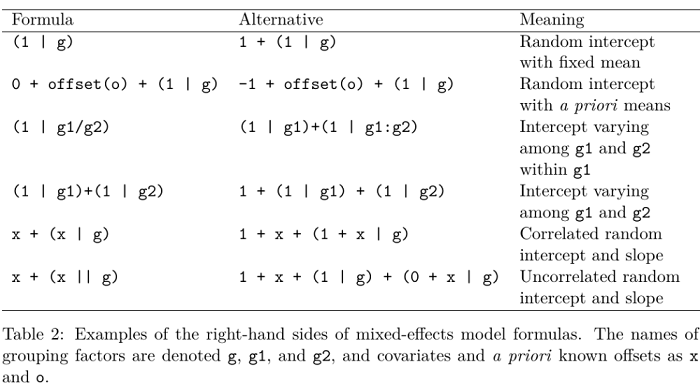

```{r setup, include=FALSE}
knitr::opts_chunk$set(echo = FALSE)

library(plyr)

load("~/GitHub/bayesianMLM/exampleData/stroopData.RData")

n         <- length(unique(stroopData$subNum))
trialNum  <- ddply(stroopData, c('subNum'), summarise, trialsNum = length(RT))
```

## Example data
* Using a mutlilevel approach that includes stimulus and participants as crossed random effects (Judd et al., 2012). 
* Stroop task:
    + `r n` participants,
    + On average `r round(mean(trialNum$trialsNum))` trials per participant,
    + Congruency: 4 incongruent vs 4 neutral words.

$$RT \sim congruency + (congruency | subNum) + (1 | stimulus)$$

## BRMS vs. lme4
- Most functions still work, e.g. `ranef()` or `fixef()`.
- Syntax the same (or very similar)


## Our BRMS model
```{r eval = false}
# Priors based on reccommendations of Andrew Gelman
priors <- c(prior(normal(0, 1), class = "Intercept"),
            prior(normal(0, 1), class = "b")) 

# Running full model
model_full <- brm(sRT ~ congruency + (congruency | subNum) + (1 | stimulus), 
                  data = stroopData,
                  prior = priors,
                  save_all_pars = TRUE,
                  sample_prior = TRUE,
                  cores = cores2use)
```


# What so special about Bayesian linear models

## Bayesian multilevel models
- Shrinkage priors
- Estimating parameters with standard error
 - shape: explain how they can vary across groups etc. name stroop as example
 - random effects
 
 - Let $\alpha$ be the common intercept and $\boldsymbol{\beta}$ be the common coefficients while
  $a_j$ is the deviation from the common intercept in the $j$-th group and $\mathbf{b}_j$ is
  the deviation from the common coefficients. Write the model as:
$$y_{ij} = \overbrace{\underbrace{\alpha + \sum_{k = 1}^K \beta_k x_{ik}}_{\mbox{Frequentist }
\boldsymbol{\mu} \mid \mathbf{x}} + a_j + \sum_{k = 1}^K b_{jk} x_{ik}}^{\mbox{Bayesian } \boldsymbol{\mu} \mid \mathbf{x},j} +\boldsymbol{\epsilon} = \\ \alpha + \sum_{k = 1}^K \beta_k x_{ik}+\underbrace{a_j + \sum_{k = 1}^K b_{jk} x_{ik}\overbrace{\boldsymbol{\epsilon}}^{\mbox{Bayesian error}}}_{\mbox{Frequentist error}}$$

Ben Goodrich, 2019 (https://mc-stan.org/workshops/stancon2019_hierarchical/) 

# Bayes factor

$$ BF_{10} =\frac{likelihood\ of\ data\ given\ H_1}{likelihood\ of\ data\ given\ H_o} = \frac{P(D|H_1)}{P(D|H_0)}$$
- Instead of integrating out marginal likelihoods, MCMC is used. 

# MCMC
- one slide explaining this


 

# Meta analysis
- sequential versus combinted analysis
- random effect analysis


# A word on priors
- cautioes,
- scaling is important

# Inference
- CI (can be interpreted without priors)
- Bayes factors

# Bayes factors
- bayes_factor, hypothesis
- savage-dickey-ratio (special caveat about priors)
- general caveat of priors with example

# Predictive checks

# Ex-gauss
Analysis of Response Time Distributions: An Example Using the Stroop Task
plot exgus

# Drawback
- takes more time
- Added complexity with priors, requires you to be more careful. 
- Pay attention to warnings

# Resources
- gelmann book
- etz paper
- Judd
- wagenmakers
- Heathcote