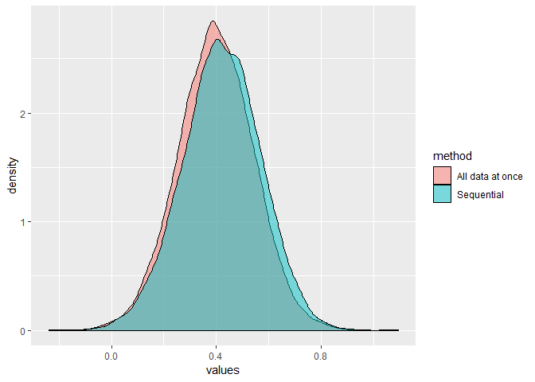
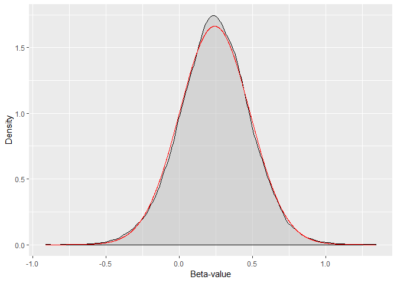
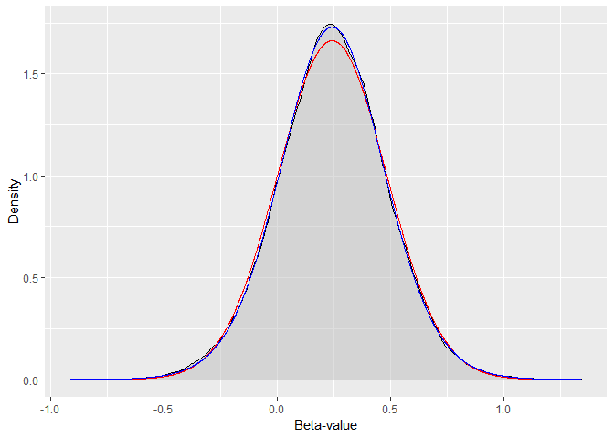

Analysing data in 1 model or sequentially
================
Jörn Alexander Quent
18 November 2019

Aim of the document
===================

This document quickly illustrates that there is no difference - in a Bayesian framework - between analysing two datasets by pooling them into one model or by analysing the first data set then and use the posterior distributions of that model as prior for the analysis.

Data generation
===============

To illustrate this behaviour, I've generated two datasets below tat a) have slightly difference sample sizes and b) different beta values.

``` r
# Script to show that it makes no difference if data is analysed in one model or sequentially
# Version 1.0
# Date: 18/11/2019
# Author: Joern Alexander Quent
# /* 
# ----------------------------- Libraries, settings and functions ---------------------------
# */
# Librarises
library(brms)
library(assortedRFunctions)

cores2use <- 4
iter      <- 15000 

# seeds
set.seed(23939)
bmrsSeeds <- sample(100000, 5)

# /* 
# ----------------------------- Generating data ---------------------------
# */
# Dataset1 
beta0 <- 3.3
beta1 <- 1
n1 <- 20
x  <- runif(n1, -3, 3)
y  <- beta0 + beta1*x + rnorm(n1, 0, 3)
data1 <- data.frame(x = x, y = y)
data1$scaledx <- scale(data1$x)
data1$scaledy <- scale(data1$y)

# Dataset2

beta0 <- 2.3
beta1 <- 1.5
n2 <- 24
x  <- runif(n2, -3, 3)
y  <- beta0 + beta1*x + rnorm(n2, 0, 3)
data2 <- data.frame(x = x, y = y)
data2$scaledx <- scale(data2$x)
data2$scaledy <- scale(data2$y)

# Concatenated data frames
dataBoth <- rbind(data1, data2)


# /* 
# ----------------------------- Combinded analysis in 1 model ---------------------------
# */
# startingPrior
startingPriors <- c(prior(normal(0, 1), class = "b")) 

# One model for both with fixed effects
model_bothFixedEffects <- brm(scaledy ~ scaledx, 
                              data = dataBoth,
                              prior = startingPriors,
                              save_all_pars = TRUE,
                              sample_prior = TRUE,
                              cores = cores2use,
                              iter = iter,
                              seed = bmrsSeeds[1])

# /* 
# ----------------------------- Sequential analys ---------------------------
# */
# Data1
model_data1 <- brm(scaledy ~ scaledx,
                   data = data1,
                   prior = startingPriors,
                   save_all_pars = TRUE,
                   sample_prior = TRUE,
                   cores = cores2use,
                   iter = iter,
                   seed = bmrsSeeds[2])

model_data1_fixef <- fixef(model_data1)


# Extract posterior and make prior
priors_data2 <- c(set_prior(priorString_normal(model_data1_fixef[1, 1], model_data1_fixef[1, 2]),
                                   class = "Intercept"),
                  set_prior(priorString_normal(model_data1_fixef[2, 1], model_data1_fixef[2, 2]),
                                   class = "b",
                                   coef = "scaledx"))

model_data2 <- brm(scaledy ~ scaledx, 
                   data = data2,
                   prior = priors_data2,
                   save_all_pars = TRUE,
                   sample_prior = TRUE,
                   cores = cores2use,
                   iter = iter,
                   seed = bmrsSeeds[3])

# /* 
# ----------------------------- Saving image ---------------------------
# */
save.image('1modelVSsequential.RData')
```

Comparing results
=================

Below you see the estimated fixed effects for pooling the data and for analysing the data subsequently.

``` r
kable(fixef(model_bothFixedEffects))
```

|           |    Estimate|  Est.Error|        Q2.5|      Q97.5|
|-----------|-----------:|----------:|-----------:|----------:|
| Intercept |  -0.0004564|  0.1437196|  -0.2834228|  0.2807192|
| scaledx   |   0.3977438|  0.1449661|   0.1119123|  0.6808579|

``` r
kable(fixef(model_data2))
```

|           |   Estimate|  Est.Error|        Q2.5|      Q97.5|
|-----------|----------:|----------:|-----------:|----------:|
| Intercept |  0.0009746|  0.1451027|  -0.2839853|  0.2860877|
| scaledx   |  0.4201233|  0.1495277|   0.1195511|  0.7071238|

As can be seen both times we obtain very similar values, however the sequential analysis a slightly higher estimate. Running the script. This is also evident density plots (see below). I run this a couple of times and I always showed that pattern.

``` r
# Posterior density
model_bothFixedEffects_postDen <- posterior_samples(model_bothFixedEffects)
model_data2_postDen            <- posterior_samples(model_data2)
nSamples                       <- dim(model_data2_postDen)[1]
df_postDensity                 <- data.frame(method = c(rep('All data at once', nSamples),
                                                       rep('Sequential', nSamples)),
                                             values = c(model_bothFixedEffects_postDen[,'b_scaledx'],
                                                       model_data2_postDen[,'b_scaledx']))

ggplot(df_postDensity, aes(x = values, fill = method)) +
  geom_density(alpha = 0.5) 
```



Furthermore, this extents to BF that can calculate based on the models. To obtain the BF for the sequential analysis, we need to multiply the BF from the first and from the second model which then is compared to the model where we pooled the data.

``` r
hypo1  <- hypothesis(model_bothFixedEffects, 'scaledx = 0')
BF10_1 <- 1/hypo1$hypothesis$Evid.Ratio

hypo2  <- hypothesis(model_data1, 'scaledx = 0')
hypo3  <- hypothesis(model_data2, 'scaledx = 0')
BF10_2 <- 1/(hypo2$hypothesis$Evid.Ratio * hypo3$hypothesis$Evid.Ratio)


kable(data.frame(Analysis = c('Pooled analysis', 'Sequential analysis'),
                 BF10 = c(BF10_1, BF10_2)))
```

| Analysis            |      BF10|
|:--------------------|---------:|
| Pooled analysis     |  4.890876|
| Sequential analysis |  5.786252|

Conclusion
----------

I asked this question in the [Stan forum](https://discourse.mc-stan.org/t/bayes-factors-for-a-series-of-experiments-using-posteriors-as-priors/10519) a while ago, where people agree that this should be equivalent. For what ever reason that is not the case. One reason I want to check is whether the using the fixed effect estimates (mean and SD) are good as priors.

For fitting the second model, I used the following prior:

``` r
kable(priors_data2)
```

| prior                                          | class     | coef    | group | resp | dpar | nlpar | bound |
|:-----------------------------------------------|:----------|:--------|:------|:-----|:-----|:------|:------|
| normal(-0.00161878633421585,0.240771040457196) | Intercept |         |       |      |      |       |       |
| normal(0.243380805361899,0.240008600578412)    | b         | scaledx |       |      |      |       |       |

In order to examine how well a normal distribution with those parameters fits I overlaid the density plot with the density calculated with `dnorm()` in red.

``` r
model_data1_postDen   <- posterior_samples(model_data1)
x <-  seq(range(model_data1_postDen$b_scaledx)[1], range(model_data1_postDen$b_scaledx)[2], 0.001)
model_data1_normalFit <- data.frame(x = x,
                                    Density = dnorm(x, model_data1_fixef[2, 1], model_data1_fixef[2, 2]))

ggplot(data.frame(model_data1_postDen$b_scaledx), aes(x = model_data1_postDen$b_scaledx)) +
  geom_density(alpha = 0.5, fill = 'grey') +
  geom_line(data = model_data1_normalFit, aes(x = x, y = Density), colour = 'red') +
  labs(x = 'Beta-value', y = 'Density')
```



The red line is considerably lower at the mode of the distribution. Therefore, I will now try a student distribution. So I start with using `brms` to fit a student distribution to the posterior distribution of model 1.

``` r
student_fit <- brm(b_scaledx ~ 1,
                   data = model_data1_postDen,
                   family = student(link = "identity", 
                                    link_sigma = "log",
                                    link_nu = "logm1"))
```

``` r
student_fit_summary <- posterior_summary(student_fit)
model_data1_fit <- data.frame(x = x,
                              Normal = dnorm(x, model_data1_fixef[2, 1], model_data1_fixef[2, 2]),
                              Student = dstudent_t(x, 
                                                   student_fit_summary[3, 1], 
                                                   student_fit_summary[1, 1],
                                                   student_fit_summary[2, 1]))

ggplot(data.frame(model_data1_postDen$b_scaledx), aes(x = model_data1_postDen$b_scaledx)) +
  geom_density(alpha = 0.5, fill = 'grey') +
  geom_line(data = model_data1_fit, aes(x = x, y = Normal), colour = 'red') +
  geom_line(data = model_data1_fit, aes(x = x, y = Student), colour = 'blue') +
  labs(x = 'Beta-value', y = 'Density')
```



The student distribution provides a much better fit to the posterior distribution than a normal distribution.

Analysis with student prior
===========================

As a test, I run the analysis again this time using student priors. The analysis script can be found \[here\]((<https://github.com/JAQuent/bayesianMLM/blob/master/variousFiles/1modelVSsequential_studentPriors.R>).

``` r
kable(fixef(model_bothFixedEffects))
```

|           |    Estimate|  Est.Error|        Q2.5|      Q97.5|
|-----------|-----------:|----------:|-----------:|----------:|
| Intercept |  -0.0004564|  0.1437196|  -0.2834228|  0.2807192|
| scaledx   |   0.3977438|  0.1449661|   0.1119123|  0.6808579|

``` r
kable(fixef(model_data2))
```

|           |   Estimate|  Est.Error|        Q2.5|      Q97.5|
|-----------|----------:|----------:|-----------:|----------:|
| Intercept |  0.0007407|  0.1438661|  -0.2845276|  0.2847372|
| scaledx   |  0.4155237|  0.1506284|   0.1155835|  0.7081582|

There is still a small difference between both analyses but it is smaller. The density distribution is still shifted to the right in the sequential analysis.

``` r
# Posterior density
model_bothFixedEffects_postDen <- posterior_samples(model_bothFixedEffects)
model_data2_postDen            <- posterior_samples(model_data2)
nSamples                       <- dim(model_data2_postDen)[1]
df_postDensity                 <- data.frame(method = c(rep('All data at once', nSamples),
                                                       rep('Sequential', nSamples)),
                                             values = c(model_bothFixedEffects_postDen[,'b_scaledx'],
                                                       model_data2_postDen[,'b_scaledx']))

ggplot(df_postDensity, aes(x = values, fill = method)) +
  geom_density(alpha = 0.5) 
```


Unsurprisingly, the BF are also different.

``` r
hypo1  <- hypothesis(model_bothFixedEffects, 'scaledx = 0')
BF10_1 <- 1/hypo1$hypothesis$Evid.Ratio

hypo2  <- hypothesis(model_data1, 'scaledx = 0')
hypo3  <- hypothesis(model_data2, 'scaledx = 0')
BF10_2 <- 1/(hypo2$hypothesis$Evid.Ratio * hypo3$hypothesis$Evid.Ratio)


kable(data.frame(Analysis = c('Pooled analysis', 'Sequential analysis'),
                 BF10 = c(BF10_1, BF10_2)))
```

| Analysis            |      BF10|
|:--------------------|---------:|
| Pooled analysis     |  4.890876|
| Sequential analysis |  5.296237|

Conclusion
----------

Is that observed difference just noise or is it actually shifted?
