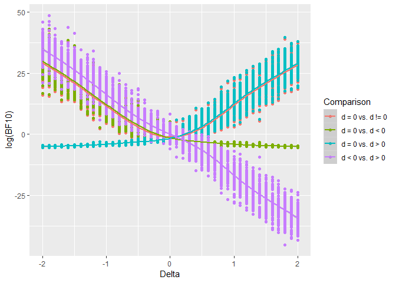

Choice of null hypothesis
================

bla
===

``` r
load('choiceOfNullHypothesis_20190918_150004.RData')
```

``` r
bfs_df <- data.frame(bfsdiffernt0 = bfs[seq(1, length(bfs), 3)],
                     bfsmaller0   = bfs[seq(2, length(bfs), 3)],
                     bfgreater0   = bfs[seq(3, length(bfs), 3)])

bfs_df$bfsmaller0vsgreater0 <- bfs_df$bfsmaller0/bfs_df$bfgreater0
bfs_df$Delta <- params$delta

bfs_df_long <- melt(bfs_df, id.vars = c('Delta'))
levels(bfs_df_long$variable) <- c('d = 0 vs. d != 0', 'd = 0 vs. d < 0', 'd = 0 vs. d > 0', 'd < 0 vs. d > 0')
names(bfs_df_long)           <- c('Delta', 'Comparison', 'BF10') 
```

``` r
ggplot(bfs_df_long, aes(x= Delta, y = log(BF10), colour = Comparison)) + geom_point() + geom_smooth()
```

    ## `geom_smooth()` using method = 'gam' and formula 'y ~ s(x, bs = "cs")'


